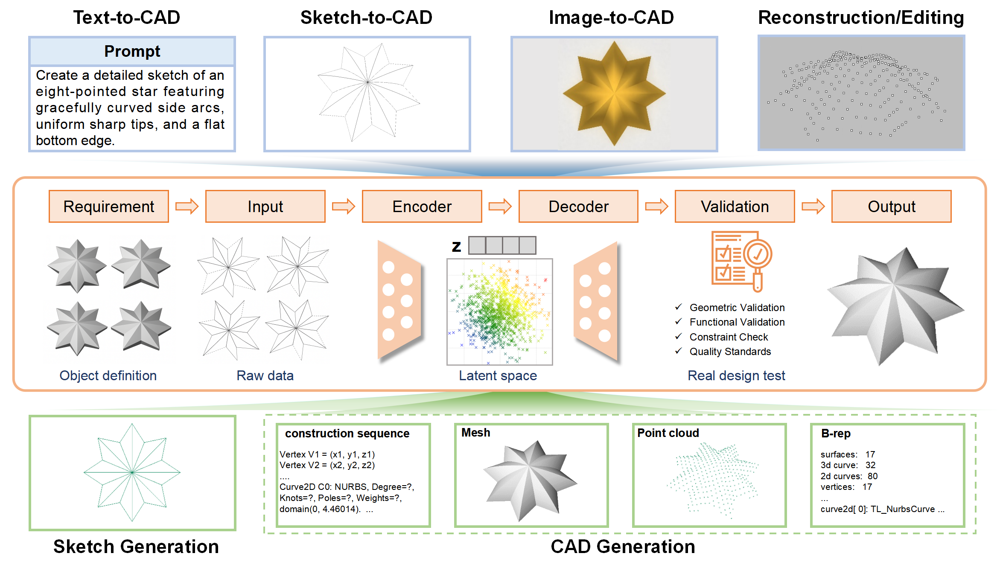
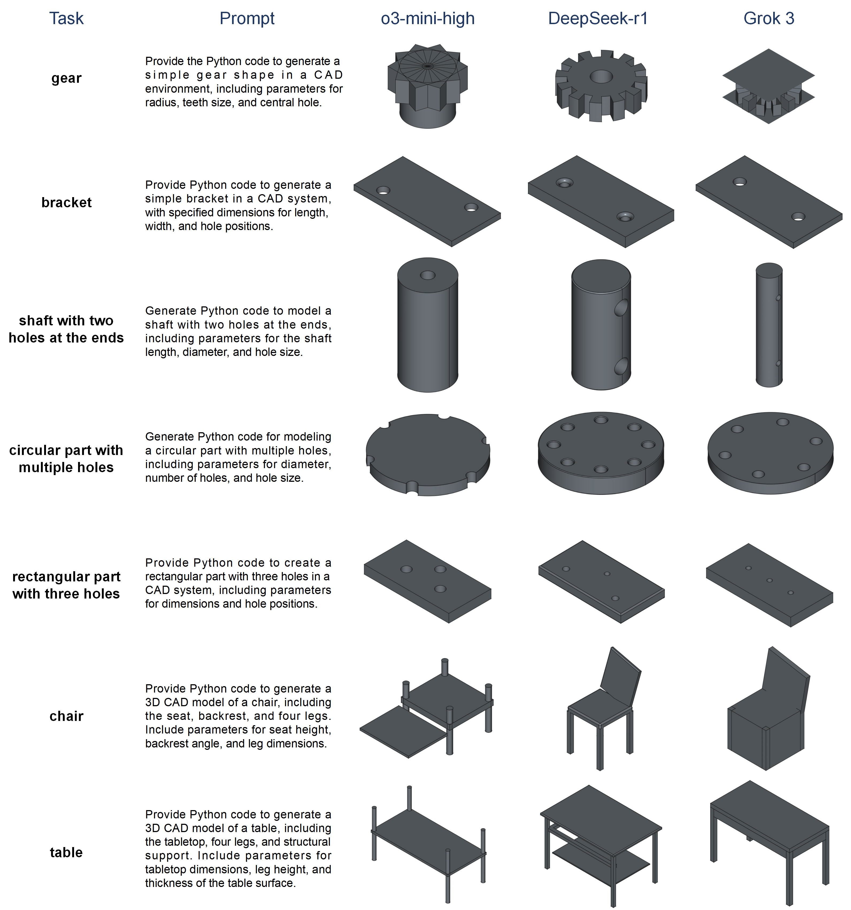

# DGM4CAD
---

## Deep Generative Models for Next-Generation Computer-Aided Design Paradigms

### Overview

This survey provides a comprehensive review of deep generative models applied to computer-aided design (CAD), highlighting their transformative potential in automating and enhancing the design process. We explore core paradigms such as Variational Autoencoders (VAEs), Generative Adversarial Networks (GANs), diffusion models, transformers, and GPT-based models, analyzing their applications in tasks like sketch generation, 3D shape synthesis, and text-to-CAD generation. Through an in-depth analysis of datasets, methods, and evaluation metrics, we identify the strengths and limitations of these models, ranging from high-quality output generation to challenges in training stability and computational efficiency. Additionally, we conduct a comparative study of large language model (LLM)-driven Python code generation for CAD tasks, evaluating models like Grok and DeepSeek-r1 for their creativity, accuracy, and reliability. As these technologies mature, they hold the promise of bridging human creativity and computational precision, ultimately redefining the landscape of design and engineering.

---

### Figure 1: Paradigms of Deep Generative Models for CAD



We summarize the paradigms centered on data modalities and task orientation. Input-driven tasks include text, sketch, and image-to-CAD, while CAD models or 3D shapes serve as inputs for tasks such as reconstruction and editing. Output modalities primarily focus on sketches, CAD models, and various 3D shapes, with a particular emphasis on sketch and CAD generation tasks. These tasks follow a typical pipeline, from requirement analysis to final output, illustrating how generative models guide the design process.

---

### Table 1: Datasets for CAD Generative Modeling

Below is a summary of key datasets used in CAD generative tasks, covering applications like sketch generation, CAD reconstruction, and text-to-CAD.

<table border="1" style="width:100%; text-align:center;">
  <tr>
    <th>Application</th>
    <th>Input</th>
    <th>Output</th>
    <th>Data</th>
    <th>Method</th>
  </tr>
  <!-- Sketch Generation -->
  <tr>
    <td rowspan="2">Sketch Generation</td>
    <td rowspan="2">sketch</td>
    <td rowspan="2">sketch</td>
    <td>15,000,000+</td>
    <td>SketchGraphs</td>
  </tr>
  <tr>
    <td>4,700,000+</td>
    <td>CAD as Language</td>
  </tr>
  <!-- CAD Reconstruction -->
  <tr>
    <td rowspan="5">CAD Reconstruction</td>
    <td rowspan="4">B-rep</td>
    <td rowspan="5">construction sequence</td>
    <td>1,000,000+</td>
    <td>ABC</td>
  </tr>
  <tr>
    <td>37,000+</td>
    <td>CC3D-Ops</td>
  </tr>
  <tr>
    <td>40,000+</td>
    <td>CADParser</td>
  </tr>
  <tr>
    <td>8,625</td>
    <td>Fusion360</td>
  </tr>
  <tr>
    <td>construction sequence</td>
    <td>179,133</td>
    <td>DeepCAD</td>
  </tr>
  <!-- Image-to-CAD -->
  <tr>
    <td rowspan="4">Image-to-CAD</td>
    <td>multi-view images</td>
    <td rowspan="4">construction sequence</td>
    <td>453,220</td>
    <td>Omni-CAD</td>
  </tr>
  <tr>
    <td rowspan="3">single image</td>
    <td>200,000+</td>
    <td>OpenECAD</td>
  </tr>
  <tr>
    <td>4,574</td>
    <td>Img2CAD</td>
  </tr>
  <tr>
    <td>208,853</td>
    <td>ABC-mono</td>
  </tr>
  <!-- Sketch-to-CAD -->
  <tr>
    <td>Sketch-to-CAD</td>
    <td>sketch</td>
    <td>construction sequence</td>
    <td>82,000+</td>
    <td>Free2CAD</td>
  </tr>
  <!-- Text-to-CAD -->
  <tr>
    <td rowspan="4">Text-to-CAD</td>
    <td rowspan="4">text</td>
    <td rowspan="2">construction sequence</td>
    <td>453,220</td>
    <td>Omni-CAD</td>
  </tr>
  <tr>
    <td>158,000+</td>
    <td>Text2CAD</td>
  </tr>
  <tr>
    <td rowspan="2">python code</td>
    <td>200</td>
    <td>CADPrompt</td>
  </tr>
  <tr>
    <td>57</td>
    <td>Query2CAD</td>
  </tr>
</table>

---

### Table 2: Generative Models for CAD Tasks

<table border="1" style="width:100%; text-align:center;">
  <tr>
    <th>Application</th>
    <th>Input</th>
    <th>Output</th>
    <th>Model</th>
    <th>Method</th>
  </tr>
  <!-- Sketch Generation -->
  <tr>
    <td rowspan="6">Sketch Generation</td>
    <td rowspan="2">None</td>
    <td rowspan="6">sketch</td>
    <td rowspan="5">Transformer</td>
    <td>CurveGen/TurtleGen</td>
  </tr>
  <tr>
    <td>CAD as Language </td>
  </tr>
  <tr>
    <td rowspan="4">sketch</td>
    <td>CAD as Language </td>
  </tr>
  <tr>
    <td>SketchGen</td>
  </tr>
  <tr>
    <td>Vitruvion</td>
  </tr>
  <tr>
    <td>VQ-VAE + Transformer</td>
    <td>HNC-CAD</td>
  </tr>
  <!-- Sketch-to-CAD -->
  <tr>
    <td rowspan="5">Sketch-to-CAD</td>
    <td rowspan="5">sketch</td>
    <td rowspan="2">3D CAD model</td>
    <td>GPT-4V + Diffusion</td>
    <td>Sketch2Prototype</td>
  </tr>
  <tr>
    <td>VAE + Diffusion</td>
    <td>RECAD</td>
  </tr>
  <tr>
    <td>3D mesh</td>
    <td>Transformer</td>
    <td>PolyGen</td>
  </tr>
  <tr>
    <td>3D shape</td>
    <td>CNN</td>
    <td>Shape Synthesis</td>
  </tr>
  <tr>
    <td>B-Rep structure</td>
    <td>Transformer</td>
    <td>SolidGen</td>
  </tr>
  <!-- CAD Generation -->
  <tr>
    <td rowspan="7">CAD Generation</td>
    <td rowspan="7">None</td>
    <td rowspan="2">3D CAD model</td>
    <td>Transformer</td>
    <td>CAD-MLLM</td>
  </tr>
  <tr>
    <td>VQ-VAE + Transformer</td>
    <td>HNC-CAD</td>
  </tr>
  <tr>
    <td>3D mesh</td>
    <td rowspan="2">GAN</td>
    <td>SDF-StyleGAN</td>
  </tr>
  <tr>
    <td rowspan="2">3D shape</td>
    <td>GRASS</td>
  </tr>
  <tr>
    <td>GPT model</td>
    <td>MeshGPT</td>
  </tr>
  <tr>
    <td>B-Rep structure</td>
    <td>Transformer</td>
    <td>SolidGen</td>
  </tr>
  <tr>
    <td>construction sequence</td>
    <td>VAE</td>
    <td>ShapeAssembly</td>
  </tr>
  <!-- Text-to-CAD -->
  <tr>
    <td rowspan="12">Text-to-CAD</td>
    <td rowspan="12">text</td>
    <td rowspan="3">3D CAD model</td>
    <td rowspan="2">Diffusion</td>
    <td>DreamGaussian</td>
  </tr>
  <tr>
    <td>Text2CAD</td>
  </tr>
  <tr>
    <td>Transformer</td>
    <td>Text2CAD</td>
  </tr>
  <tr>
    <td rowspan="4">3D mesh</td>
    <td>CNN + GRU + GAN</td>
    <td>Text2Shape</td>
  </tr>
  <tr>
    <td>Diffusion</td>
    <td>Magic3D</td>
  </tr>
  <tr>
    <td>Transformer</td>
    <td>SkexGen</td>
  </tr>
  <tr>
    <td>VQ-VAE + Transformer</td>
    <td>CLIP-Sculptor</td>
  </tr>
  <tr>
    <td rowspan="2">3D shape</td>
    <td>CLIP + Flow</td>
    <td>CLIP-Forge</td>
  </tr>
  <tr>
    <td>VQ-VAE + Transformer</td>
    <td>ShapeGPT</td>
  </tr>
  <tr>
    <td>construction sequence</td>
    <td>GPT model</td>
    <td>CAD-GPT</td>
  </tr>
  <tr>
    <td rowspan="2">python code</td>
    <td>GPT-4</td>
    <td>CADCodeVerify</td>
  </tr>
  <tr>
    <td>GPT-4 + BLIP2</td>
    <td>Query2CAD</td>
  </tr>
  <!-- Image-to-CAD -->
  <tr>
    <td rowspan="9">Image-to-CAD</td>
    <td rowspan="9">image</td>
    <td rowspan="5">3D CAD model</td>
    <td>Autoencoder</td>
    <td>Deep CAD/CAE</td>
  </tr>
  <tr>
    <td>Diffusion</td>
    <td>DreamGaussian</td>
  </tr>
  <tr>
    <td>Transformer</td>
    <td>CAD-MLLM</td>
  </tr>
  <tr>
    <td>Transformer + Diffusion</td>
    <td>GenCAD</td>
  </tr>
  <tr>
    <td>VAE</td>
    <td>Synthesizing 3D</td>
  </tr>
  <tr>
    <td>3D shape</td>
    <td>VQ-VAE + Transformer</td>
    <td>ShapeGPT</td>
  </tr>
  <tr>
    <td>B-Rep structure</td>
    <td>Transformer</td>
    <td>SolidGen</td>
  </tr>
  <tr>
    <td rowspan="2">construction sequence</td>
    <td>GPT model</td>
    <td>CAD-GPT</td>
  </tr>
  <tr>
    <td>CLIP + Transformer</td>
    <td>OpenECAD</td>
  </tr>
  <!-- Reconstruction -->
  <tr>
    <td rowspan="10">Reconstruction</td>
    <td>3D CAD model</td>
    <td>3D CAD model</td>
    <td>VAE</td>
    <td>SDM-NET</td>
  </tr>
  <tr>
    <td rowspan="4">3D shape</td>
    <td>3D mesh</td>
    <td>Diffusion</td>
    <td>PolyDiff</td>
  </tr>
  <tr>
    <td rowspan="2">3D shape</td>
    <td>GAN</td>
    <td>GRASS</td>
  </tr>
  <tr>
    <td>GPT model</td>
    <td>MeshGPT</td>
  </tr>
  <tr>
    <td rowspan="2">construction sequence</td>
    <td>CNN + GRU</td>
    <td>CSGNet</td>
  </tr>
  <tr>
    <td>construction sequence</td>
    <td>Transformer</td>
    <td>DeepCAD</td>
  </tr>
  <tr>
    <td rowspan="4">point cloud</td>
    <td>3D CAD model</td>
    <td>Transformer</td>
    <td>Point2Cyl</td>
  </tr>
  <tr>
    <td>3D shape</td>
    <td>GAN</td>
    <td>SDF-StyleGAN</td>
  </tr>
  <tr>
    <td>B-Rep structure</td>
    <td>CNN + Transformer</td>
    <td>ComplexGen</td>
  </tr>
  <tr>
    <td>construction sequence</td>
    <td>Diffusion</td>
    <td>CAD-Diffuser</td>
  </tr>
  <!-- CAD Editing -->
  <tr>
    <td rowspan="3">CAD Editing</td>
    <td rowspan="2">partial shape</td>
    <td>3D CAD model</td>
    <td rowspan="2">VQ-VAE + Transformer</td>
    <td>HNC-CAD</td>
  </tr>
  <tr>
    <td>3D shape</td>
    <td>ShapeGPT</td>
  </tr>
  <tr>
    <td>point cloud</td>
    <td>3D mesh</td>
    <td>GAN</td>
    <td>SDF-StyleGAN</td>
  </tr>
</table>

---

### Case Studies: Comparative Analysis of LLM-Driven CAD Generation



Comparison of CAD models generated by different LLMs (o3-mini-high, DeepSeek-r1, Grok) based on Python code for various shapes. The figure illustrates the diverse levels of accuracy, creativity, and model quality exhibited by the evaluated models.

---

### Example Python Code Using Grok

Below is an example of Python code generated using Grok for a simple CAD task (e.g., generating a 3D model of a table). This code can be executed in FreeCAD to produce the corresponding CAD model.

```python
import FreeCAD
import Part

def create_table_model(tabletop_length, tabletop_width, tabletop_thickness, leg_height, leg_size, support_height, support_thickness):
    """
    Generate a 3D CAD model of a table in FreeCAD.
    
    Parameters:
    - tabletop_length (float): Length of the tabletop (X-direction)
    - tabletop_width (float): Width of the tabletop (Y-direction)
    - tabletop_thickness (float): Thickness of the tabletop (Z-direction)
    - leg_height (float): Height of the legs (Z-direction)
    - leg_size (float): Cross-sectional size of the legs (assumed square)
    - support_height (float): Vertical height of the structural supports
    - support_thickness (float): Thickness of the structural supports
    """
    
    # Create the tabletop
    # Positioned centered in XY, with base at Z=leg_height
    tabletop = Part.makeBox(
        tabletop_length,
        tabletop_width,
        tabletop_thickness,
        FreeCAD.Vector(-tabletop_length/2, -tabletop_width/2, leg_height),
        FreeCAD.Vector(0, 0, 1)
    )
    
    # Create the four legs
    # Legs extend from Z=0 to Z=leg_height, positioned at the corners
    leg1 = Part.makeBox(
        leg_size,
        leg_size,
        leg_height,
        FreeCAD.Vector(-tabletop_length/2, -tabletop_width/2, 0),  # Front-left
        FreeCAD.Vector(0, 0, 1)
    )
    leg2 = Part.makeBox(
        leg_size,
        leg_size,
        leg_height,
        FreeCAD.Vector(tabletop_length/2 - leg_size, -tabletop_width/2, 0),  # Front-right
        FreeCAD.Vector(0, 0, 1)
    )
    leg3 = Part.makeBox(
        leg_size,
        leg_size,
        leg_height,
        FreeCAD.Vector(-tabletop_length/2, tabletop_width/2 - leg_size, 0),  # Back-left
        FreeCAD.Vector(0, 0, 1)
    )
    leg4 = Part.makeBox(
        leg_size,
        leg_size,
        leg_height,
        FreeCAD.Vector(tabletop_length/2 - leg_size, tabletop_width/2 - leg_size, 0),  # Back-right
        FreeCAD.Vector(0, 0, 1)
    )
    
    # Create structural supports (aprons)
    # Positioned just below the tabletop, between the legs
    front_apron = Part.makeBox(
        tabletop_length - 2 * leg_size,
        support_thickness,
        support_height,
        FreeCAD.Vector(-tabletop_length/2 + leg_size, -tabletop_width/2, leg_height - support_height),
        FreeCAD.Vector(0, 0, 1)
    )
    back_apron = Part.makeBox(
        tabletop_length - 2 * leg_size,
        support_thickness,
        support_height,
        FreeCAD.Vector(-tabletop_length/2 + leg_size, tabletop_width/2 - support_thickness, leg_height - support_height),
        FreeCAD.Vector(0, 0, 1)
    )
    left_apron = Part.makeBox(
        support_thickness,
        tabletop_width - 2 * leg_size,
        support_height,
        FreeCAD.Vector(-tabletop_length/2, -tabletop_width/2 + leg_size, leg_height - support_height),
        FreeCAD.Vector(0, 0, 1)
    )
    right_apron = Part.makeBox(
        support_thickness,
        tabletop_width - 2 * leg_size,
        support_height,
        FreeCAD.Vector(tabletop_length/2 - support_thickness, -tabletop_width/2 + leg_size, leg_height - support_height),
        FreeCAD.Vector(0, 0, 1)
    )
    
    # Combine all parts into a single compound shape
    all_parts = [tabletop, leg1, leg2, leg3, leg4, front_apron, back_apron, left_apron, right_apron]
    table = Part.makeCompound(all_parts)
    
    # Add the model to the FreeCAD document
    doc = FreeCAD.activeDocument()
    if not doc:
        doc = FreeCAD.newDocument("Table")
    obj = doc.addObject("Part::Feature", "Table")
    obj.Shape = table
    doc.recompute()
    return obj

# Example usage
if __name__ == "__main__":
    create_table_model(
        tabletop_length=120.0,    # Length of the tabletop in mm
        tabletop_width=60.0,      # Width of the tabletop in mm
        tabletop_thickness=5.0,   # Thickness of the tabletop in mm
        leg_height=70.0,          # Height of the legs in mm
        leg_size=5.0,             # Cross-sectional size of the legs in mm
        support_height=10.0,      # Height of the structural supports in mm
        support_thickness=2.0     # Thickness of the structural supports in mm
    )
```

This code fulfills the requirement to create a 3D CAD model of a table with the specified components and parameters using Python in FreeCAD.
